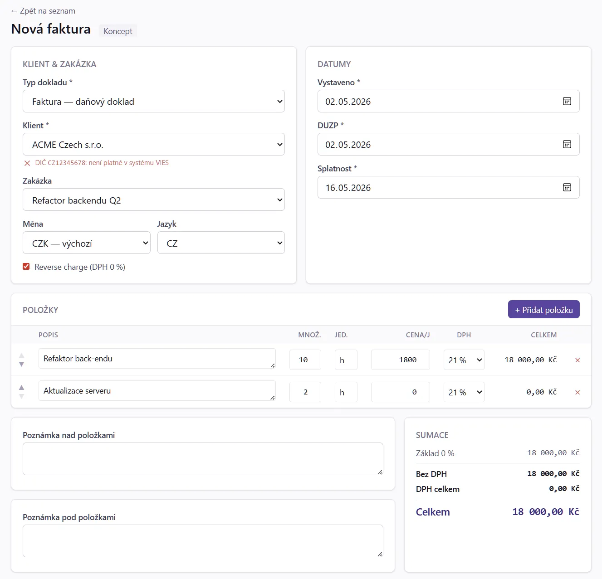
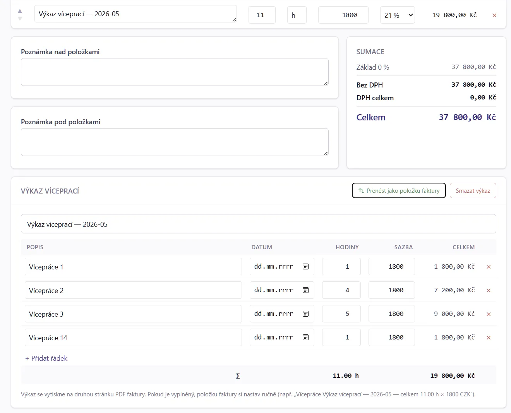

# 9. Faktura — editor a výkaz víceprací

Editor faktury slouží k tvorbě nového konceptu nebo úpravě existujícího.
Otevře se přes **+ Nová faktura** (z dashboardu), **Faktury → Nová faktura**,
nebo z detailu klienta / zakázky.

## 9.1 Editor — celkový přehled



Editor je rozdělený na tři bloky:

1. **Hlavička** (vlevo nahoře) — typ, klient, zakázka, data
2. **Položky** (střed) — řádky faktury
3. **Sumář a akce** (vpravo nahoře + dole) — částky, sleva, tlačítka

## 9.2 Hlavička

### 9.2.1 Typ dokladu

| Typ | Popis | Variabilní symbol |
|---|---|---|
| **Faktura** | Standardní daňový doklad | YYMMNNN — `2605001` |
| **Zálohová (proforma)** | Před DUZP, není daňový doklad. Po zaplacení můžeš z ní vytvořit „Daňový doklad" se započtením zálohy. | `9` + YYMMNNN — `92605001` |
| **Dobropis (opravný daňový doklad)** | Záporné částky, stornuje původní fakturu | `7` + YYMMNNN — `72605001` |
| **Storno (interní)** | Pouze interní označení, nevystavuje se klientovi | (bez prefixu) |

### 9.2.2 Klient + Zakázka

- **Klient** (povinný) — vyber z dropdownu, vyhledávání podle jména / IČ.
- **Zakázka** (volitelná) — pokud klient má zakázky, dropdown nabídne jen jeho
  vlastní. Po výběru zakázky se předvyplní hodinová sazba a splatnost.

> ⚠️ Pokud změníš klienta uprostřed editace, zakázka se vyresetuje (původní
> patřila jinému klientovi).

### 9.2.3 Data

| Pole | Význam |
|---|---|
| Vystaveno | Datum vystavení (dnes default) |
| DUZP | Datum uskutečnění zdanitelného plnění (= vystaveno default) |
| Splatnost | Datum splatnosti — automaticky vypočítáno z `vystaveno + splatnost zakázky` (nebo klienta nebo systému) |
| Datum úhrady | Vyplní se automaticky při zaplacení (přes banku nebo manuálně) |

### 9.2.4 Měna a DPH

- **Měna** — předvyplní se z klienta (nebo zakázky), lze přepsat.
- **Reverse charge** — checkbox; pokud zatržené, faktura bude bez DPH s textem
  „Daň přiznává odběratel". Předvyplní se z klienta.

## 9.3 Položky

Tabulka řádků faktury. Tlačítko **+ Přidat položku** přidá nový řádek.

| Sloupec | Význam |
|---|---|
| Popis | Co fakturuješ. Lze multiline. **Tip:** pokud je v popisu měsíc (`Konzultace 3/2026`), klonování faktury automaticky inkrementuje. |
| Množství | Počet jednotek (kusy / hodiny / …) |
| Jednotka | `ks` / `hod` / `den` / `měs.` / `–` (volitelný popis) |
| Cena/jed. | Jednotková cena (bez DPH pokud máš DPH na konci, jinak včetně) |
| DPH | Sazba — `21 %`, `12 %`, `0 %` (osvobozeno), `RC` (reverse charge) |
| Celkem | Auto-počítáno (množství × cena/jed.) |

### 9.3.1 Drag & drop pořadí

Levým úchytem (☰) přetáhni položky pro změnu pořadí. Pořadí se zachová
v PDF.

### 9.3.2 Smazání položky

Křížek vpravo. Pokud položka je propojená s výkazem víceprací (viz § 9.6),
smazání se zeptá, jestli i smazat výkaz.

## 9.4 Sumář (vpravo)

Automaticky se přepočítává:

- **Mezisoučet** — součet `množství × cena/jed.` všech položek
- **Sleva** — pokud je vyplněná (% nebo absolutní, pole vlevo)
- **Základ DPH** — po slevě
- **DPH 21 % / 12 % / 0 %** — rozdělené podle sazeb v položkách
- **Celkem k úhradě** — final částka v měně faktury

### 9.4.1 Sleva

Pole **Sleva** podporuje:

- `10 %` → procentuální sleva z mezisoučtu
- `1500` → absolutní sleva v měně faktury
- `1500 Kč` → totéž

## 9.5 Tlačítka

| Tlačítko | Funkce |
|---|---|
| **Uložit koncept** | Uloží jako `draft` — zůstane v konceptech, neviditelné pro klienta |
| **Vystavit** | Přidělí variabilní symbol, vygeneruje PDF, status → `issued`. **Nelze vrátit zpět** (jen storno / dobropis). |
| **Vystavit a odeslat** | Vystaví + okamžitě pošle e-mailem klientovi |
| **Náhled PDF** | Otevře PDF v novém tabu (jen pro koncepty s vodoznakem „NÁHLED") |
| **Smazat koncept** | Jen pro `draft` — nelze smazat vystavenou |
| **Klonovat** | Vytvoří nový koncept jako kopii (kapitola 8 „Vystavit znovu") |

## 9.6 Výkaz víceprací (work report)

Pokud fakturuješ za **hodiny**, můžeš ke každé hodinové položce přidat detailní
výkaz, který se vytiskne na **2. stranu PDF**.



### 9.6.1 Aktivace

V editoru klikni na šedou ikonu „Přidat výkaz víceprací" v řádku položky.
Zobrazí se modal/sekce:

| Pole | Význam |
|---|---|
| Datum | Den práce |
| Popis | Co bylo děláno |
| Hodiny | Desetinné číslo (1.5, 0.25, …) |
| Sazba | Default ze zakázky, lze přepsat |
| Celkem | Auto: `hodiny × sazba` |

Přidej řádky → tlačítko **Uložit výkaz**. Suma hodin × sazba se přenese do
hlavní položky faktury (pole „Množství" + „Cena/jed.").

### 9.6.2 PDF výstup

Druhá strana PDF má formát:

```
+--------------------------------------------------+
| Výkaz víceprací — faktura 2605001               |
|                                                  |
| Datum     Popis                Hod.  Sazba   Kč |
| 03.05.    Konzultace strategie  2.0  1500   3000 |
| 04.05.    Code review           1.5  1500   2250 |
| ...                                              |
|                                                  |
| Celkem hodin: 12.5                              |
| Celkem k úhradě: 18 750 Kč                      |
+--------------------------------------------------+
```

### 9.6.3 Smazání výkazu

V editoru klik na ikonu odpojit (řetěz). Položka faktury zůstane, ale ztratí
detailní rozpis.

## 9.7 Zálohová faktura → daňový doklad

Workflow:

1. Vystavíš **zálohovou (proforma)** — variabilní symbol `9NNNNNN`, status
   `issued`, žádné DUZP.
2. Klient zaplatí — banka spáruje (nebo manuálně označíš jako `paid`).
3. Klikneš **Vystavit daňový doklad** (tlačítko v detailu zálohové).
4. Vytvoří se **daňový doklad** typu „Faktura" s automatickým **odečtem
   zaplacené zálohy** (záporná položka „Odpočet zálohy 92605001").

## 9.8 Storno vs. dobropis

Pokud zjistíš, že vystavená faktura je špatně:

- **Storno (interní)** — pouze interní označení, faktura zmizí ze statistik
  jako „neexistuje". **Klientovi se nic neposílá.** Použij, když jsi fakturu
  ještě neposlal a nechceš ji v evidenci.
- **Dobropis (opravný daňový doklad)** — vystavíš nový doklad se zápornými
  položkami, který klientovi pošleš jako oficiální opravu. Účetně správné, ale
  vyžaduje, abys měl s klientem komunikaci o tom, co a proč.

## 9.9 Tipy

- **Vždy uložené jako koncept** — Ctrl+S kdykoli uloží rozpracovanou fakturu.
- **Klonování zachová položky i výkaz víceprací** — datum se aktualizuje na
  dnešní, popis položky inkrementuje měsíc.
- **Sleva v procentech** se počítá z mezisoučtu **před** DPH.
- **Reverse charge** automaticky nastaví všechny položky na sazbu „RC" (0 %)
  a v PDF přidá text „Daň přiznává odběratel".
- **PDF náhled konceptu** má vodoznak „NÁHLED" přes celou stranu — klient si ho
  spletl s vystavenou fakturou by neměl.
