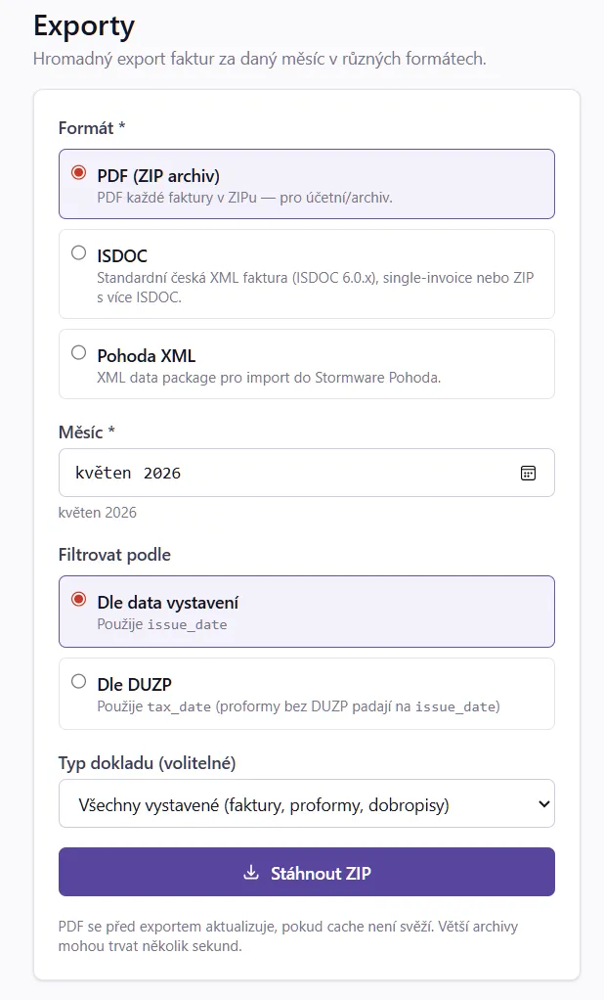

# 13. Exporty (PDF ZIP, ISDOC, Pohoda XML)

Pro účetní (interní oddělení nebo externí kancelář) nabízí MyInvoice tři
formáty hromadného exportu:

| Formát | Pro koho | Co obsahuje |
|---|---|---|
| **PDF ZIP** | Klasická archivace | Všechna PDF za zvolené období v ZIP archivu |
| **ISDOC 6.0.2** | Český národní standard pro B2B výměnu faktur | XML soubor pro každou fakturu, balené v ZIP |
| **Pohoda XML** | Stormware Pohoda — přímý import bez ručního opisu | Sloučený dataPack XML soubor |

## 13.1 Obrazovka exportů

V hlavním menu **Systém → Exporty**.



Formulář:

| Pole | Význam |
|---|---|
| Formát | `PDF ZIP` / `ISDOC` / `Pohoda XML` |
| Období | Měsíc-rok (např. „Duben 2026") |
| Typ | Všechny / Faktury / Zálohové / Dobropisy |
| Stav | Vystavené (default) / Zaplacené / Vše |

Klik **Stáhnout** → soubor stažen do prohlížeče.

## 13.2 PDF ZIP

Nejjednodušší archivace. ZIP obsahuje:

```
faktury-2026-04.zip
├── 2604001-Faktura.pdf
├── 2604002-Faktura.pdf
├── 92604001-Zalohova.pdf
├── 72604001-Dobropis.pdf
└── ...
```

Název souboru: `<varsymbol>-<typ>.pdf`.

Použití: **roční archivace** pro účetní (předáš ZIP/měsíc), **založení do
spisu**, **odeslání e-mailem revizorovi**.

## 13.3 ISDOC 6.0.2

ISDOC je český národní standard pro elektronickou výměnu faktur. Definovaný
[ISDOC.cz](http://www.isdoc.cz/) — používá ho většina českých účetních
softwarů (Money S3, Helios, Stereo, ABRA).

### 13.3.1 Struktura souboru

Každá faktura má vlastní `.isdoc` XML soubor podle ISDOC 6.0.2 schématu.
ZIP obsahuje:

```
isdoc-2026-04.zip
├── 2604001.isdoc       (XML)
├── 2604002.isdoc
├── ...
└── manifest.xml         (volitelný — seznam dokumentů)
```

### 13.3.2 DocumentType

Mapování v ISDOC:

| MyInvoice typ | ISDOC DocumentType |
|---|---|
| Faktura | `1` (běžná faktura) |
| Zálohová (proforma) | `2` (zálohová) |
| Dobropis | `5` (opravný daňový doklad) |
| Storno | (neexportuje se — interní) |

### 13.3.3 PaymentMeansCode

| Způsob platby | Kód |
|---|---|
| Bankovní převod (CZ) | `42` |
| SEPA převod (EU) | `31` |
| Hotovost | `10` |

### 13.3.4 Import do účetního software

| Software | Kde naimportovat |
|---|---|
| **Money S3** | Karty → Faktury vydané → Načíst z ISDOC |
| **Pohoda** | Externí komunikace → Import dat → ISDOC |
| **Helios Orange** | Faktury vydané → Akce → Import ISDOC |
| **Stereo** | Účetní → Import → ISDOC |

## 13.4 Pohoda XML (Stormware data package)

Pohoda XML je **proprietary formát firmy Stormware** pro přímý import faktur
do účetního systému Pohoda. Na rozdíl od ISDOC je to **jeden velký XML**
(`dataPack`), ne soubor per fakturu.

### 13.4.1 Struktura

```xml
<?xml version="1.0" encoding="UTF-8"?>
<dat:dataPack xmlns:dat="..." xmlns:inv="..." xmlns:typ="..." version="2.0">
  <dat:dataPackItem id="2604001">
    <inv:invoice version="2.0">
      <inv:invoiceHeader>
        <inv:invoiceType>issuedInvoice</inv:invoiceType>
        <inv:number>
          <typ:numberRequested>2604001</typ:numberRequested>
        </inv:number>
        ...
```

### 13.4.2 Per-dodavatel konfigurace

Před prvním exportem do Pohody **musíš nastavit Pohoda kódy v dodavateli**:

**Systém → Dodavatelé → [tvůj] → Editovat → záložka Pohoda**

| Pole | Význam | Příklad |
|---|---|---|
| Číselná řada | Kód číselné řady v Pohodě | `FV` |
| Středisko | Kód střediska | `01` |
| Činnost | Kód činnosti | `100` |
| Předkontace | Kód předkontace | `300` |

Bez vyplnění některého z těchto polí export proběhne, ale **import do Pohody
hodí varování** — musíš v Pohodě dovyplnit při importu.

### 13.4.3 VAT klasifikace

MyInvoice mapuje DPH sazby na **Pohoda kódy klasifikace**:

| MyInvoice DPH | Pohoda kód |
|---|---|
| 21 % | `UDA5` (úprava DPH 21 %) |
| 12 % | `UDA5_12` (úprava DPH 12 %) |
| 0 % osvobozeno | `UNX` (osvobozeno) |
| 0 % reverse charge | `PNAR` (přenesená daňová povinnost) |

### 13.4.4 Import do Pohody

1. Pohoda → **Soubor → Datová komunikace → XML import / export**
2. **Import** → vyber `myinvoice-pohoda-2026-04.xml`
3. Pohoda zobrazí náhled (kolik faktur, jaké částky)
4. Klik **Importovat** → faktury se založí

### 13.4.5 Co Pohoda XML neobsahuje

- **PDF přílohu faktury** (Pohoda generuje vlastní PDF z dat)
- **Výkaz víceprací** (přílohy se neexportují)
- **QR platbu** (Pohoda generuje vlastní)

Pokud klient potřebuje přesně tvoji PDF verzi, použij paralelně **PDF ZIP**.

## 13.5 Filtrování

| Volba | Použití |
|---|---|
| Typ = Faktury (jen) | Klasický měsíční export pro účetní |
| Stav = Zaplacené | Pro výplatu DPH (jen reálně přijaté) |
| Typ = Dobropisy | Pro samostatnou agendu oprav |

## 13.6 Tipy

- **Měsíční rytmus** — exportuj 1. den následujícího měsíce za ten skončený
  měsíc.
- **ISDOC i Pohoda** — pokud si nejsi jistý, který formát použít, **ISDOC**
  je univerzální (otevřený standard, fungují různé softwary). Pohoda XML jen
  když víš, že příjemce má Pohodu.
- **Stáhni i PDF ZIP jako backup** — XML formáty obsahují data, ale ne grafiku
  PDF. Pokud archivuješ pro daňové účely, mít originální PDF je nutné.
- **Před prvním exportem do Pohody** → konzultuj s účetní, jaké chce kódy
  střediska / činnosti / předkontace. Bez nich import není čistý.
